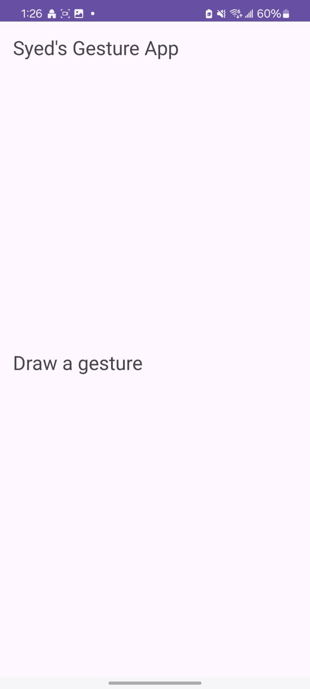
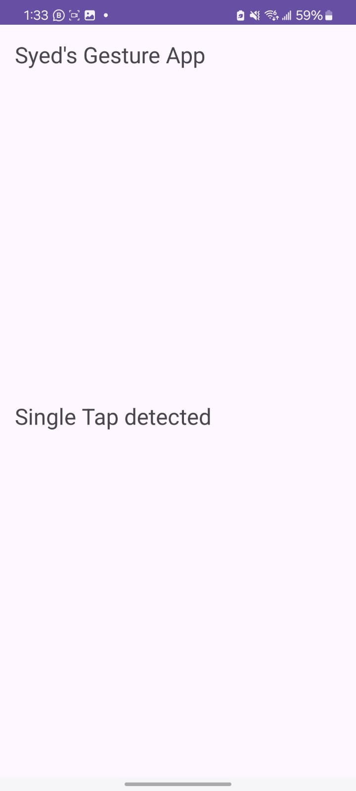
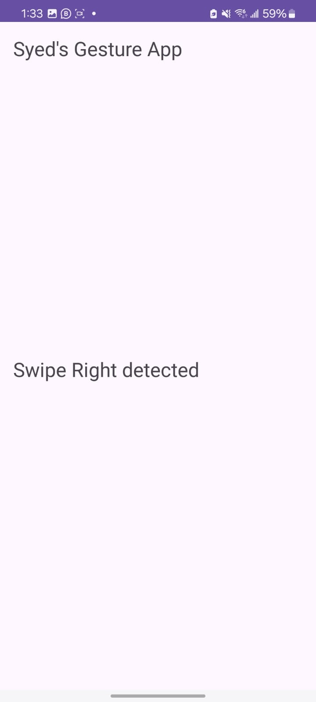
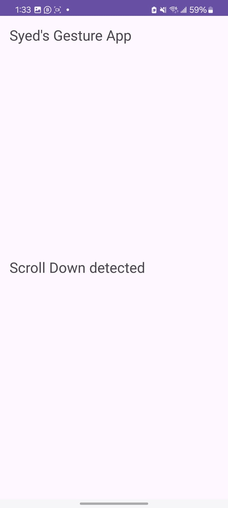
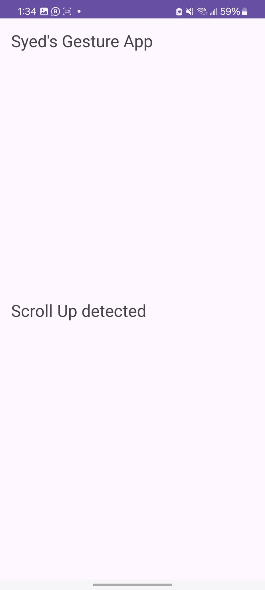
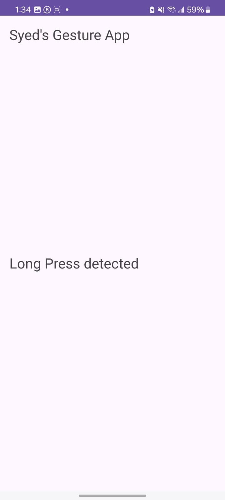
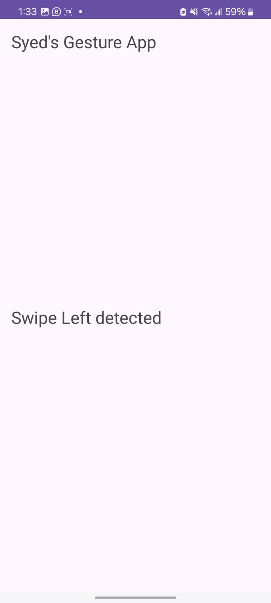

# GestureApp

GestureApp is a mobile application designed to recognize and interpret gestures using the phone's built-in sensors or camera.

## Key Features:
1. **Gesture Recognition**: Recognizes swipes, taps, and shakes.
2. **User Interface**: Clean and intuitive UI with animated feedback.
3. **Custom Gestures**: Allows users to create and configure their own gestures.

## Technologies Used:
- Android Studio
- Java
- Sensors API
- Optional ML Kit for camera-based gesture recognition

## Workflow Diagram:
Gesture -> Detection -> Interpretation -> Action

## Future Updates:
- Support for more complex gestures using machine learning.

## Screenshots:

